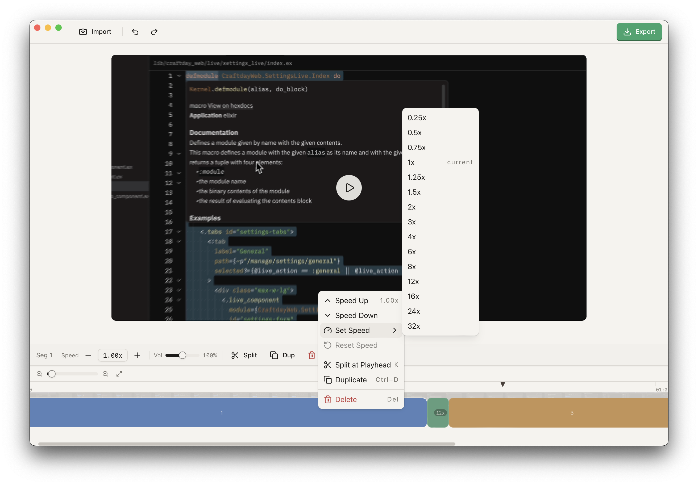

<p align="center">
  
</p>

<h1 align="center">Hooj</h1>

<p align="center">
  A lightweight desktop video editor built with Tauri and React.
</p>

<p align="center">
  <a href="LICENSE"></a>
  
  <a href="https://github.com/puemos/hooj/actions"></a>
</p>

<p align="center">
  
</p>

## Features

- **Multi-format import** — MP4, MKV, AVI, MOV, and WebM
- **Nondestructive editing** — Split, trim, reorder, duplicate, and delete segments
- **Speed & volume control** — Per-segment speed (0.1x–32x) and volume (0–200%)
- **Visual timeline** — Drag-and-drop segments with thumbnail previews
- **Undo/redo** — 50-step history
- **Flexible export** — MP4 (H.264), WebM (VP9), or MOV (ProRes) with three quality presets
- **Real-time progress** — Live export progress feedback
- **Smart encoding** — Stream copy when no speed or volume changes are applied
- **Keyboard shortcuts** — Common operations accessible from the keyboard

## Download

> macOS only. Other platforms are untested.

Grab the latest release from the [Releases](https://github.com/puemos/hooj/releases) page.

## Built With

[Tauri v2](https://tauri.app) · [React 19](https://react.dev) · [Rust](https://www.rust-lang.org) · [FFmpeg](https://ffmpeg.org)

## Development

### Prerequisites

- macOS
- Rust (stable, 2024 edition)
- Node.js and pnpm
- FFmpeg (`brew install ffmpeg`)

### Setup

```bash
git clone https://github.com/puemos/hooj.git
cd hooj
scripts/setup-ffmpeg.sh
cd frontend && pnpm install
```

### Run

```bash
cargo tauri dev
```

### Build

```bash
cargo tauri build
```

### Tests

```bash
cargo test                           # Rust tests
cd frontend && pnpm test -- --run    # Frontend tests
```

## Architecture

Tauri v2 app with a Rust backend and React 19 frontend. FFmpeg runs as a sidecar binary for all video processing.

```
src/
  commands/      Tauri IPC handlers
  domain/        Project, Segment, ExportSettings
  application/   Undo/redo history
  infra/         FFmpeg command building and execution
  state/         Shared app state
frontend/
  src/
    components/  React components and timeline
    hooks/       Tauri IPC hooks, keyboard shortcuts
    store/       Zustand stores
    lib/         Utilities
```

## License

[MIT](LICENSE)
